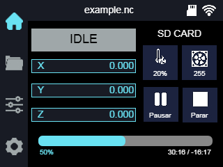
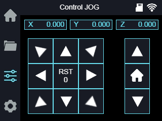
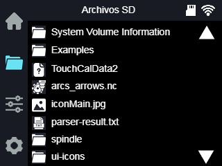

# ILI TFT + GRBL ESP32 Interface

## CNC Touch Interface for ESP32

This project is a touch interface developed to control a CNC machine using an ESP32 and an ILI TFT touchscreen.

The interface allows for visual, intuitive, and fast interaction with the machine, displaying relevant information in real time and allowing actions to be executed directly from the screen.

---

# Interface

## 🔹 Work Screen

View where you can observe the work in progress and perform actions such as pausing or stopping the job.

---

## 🔹 Jog Control

Real-time display of the machine's status and position, allowing manipulation of the 3 axes or performing actions such as home or set zero.

---

## 🔹 SD Navigation

Browse files directly from the SD card, including the ability to start jobs from it.

---

# What does it do?

- Displays a customized home screen
- Allows navigation between different views
- Detects touch interaction
- Manages graphical buttons with active/inactive icons
- Displays machine status information
- Supports SD card reading
- Designed to integrate with GRBL on ESP32

---

# Project Goal

To create a modern, organized, and scalable interface for machines controlled by ESP32, offering a clear and professional user experience.

The goal is to build a solid foundation that allows for continued system expansion without sacrificing order or stability.

---

# Main Features

- Optimized touch interface
- Dynamic button system
- Smooth screen switching
- Ready for real CNC control
- Modular and expandable design

---

# Hardware Used

- ESP32
- ILI TFT touchscreen
- SD card
- GRBL-compatible CNC

---

# Author

Developed by **Kosey**

Interface designed and programmed as part of a personal project focused on creating a more organized and professional solution for home CNC control using an ESP32.

---

# Project Status

Actively under development.

Currently focused on:

- Visual optimization
- Improved internal states
- Advanced integration with GRBL
- Greater SD card read stability

# Compiling warnings

The TFT ILI library used in PlatformIO is not compatible with the current version of grbl, so some local changes to the library are required.

---

#More information about GRBL ESP32
https://github.com/bdring/Grbl_Esp32
